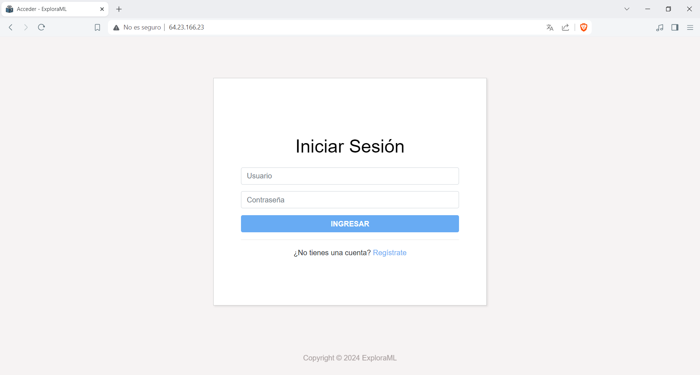
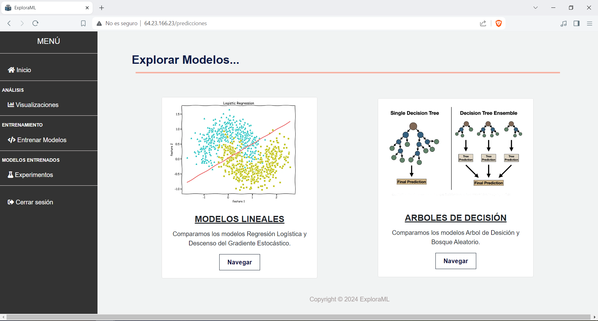
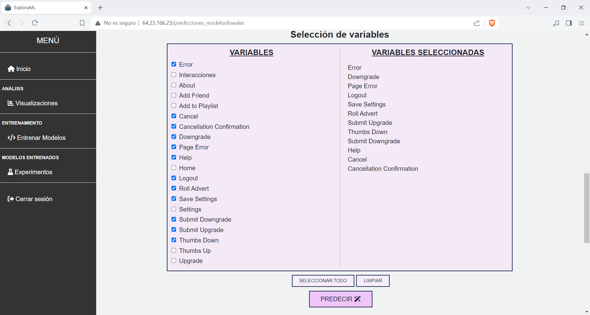
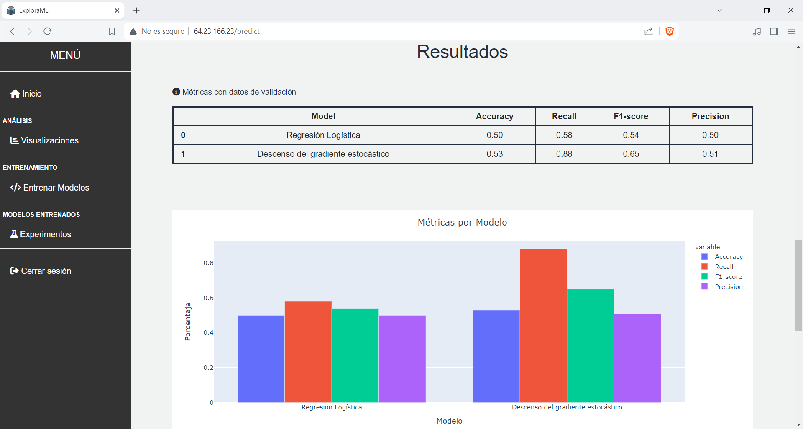
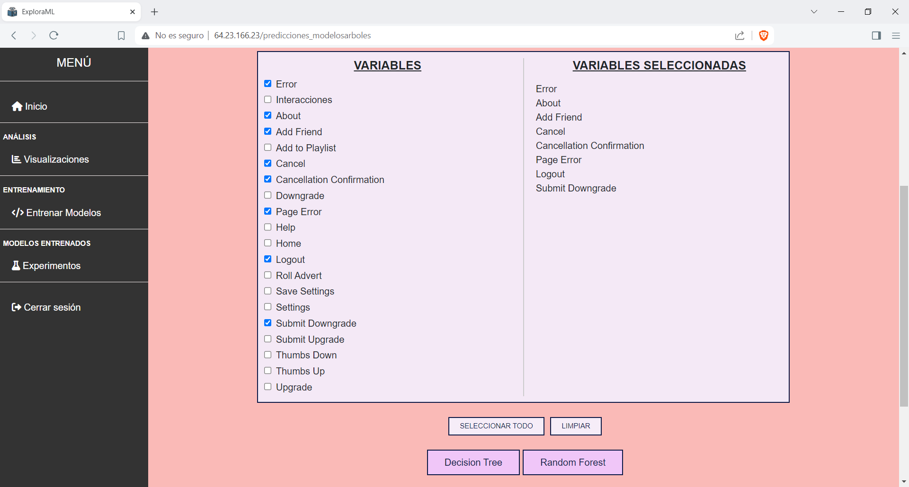
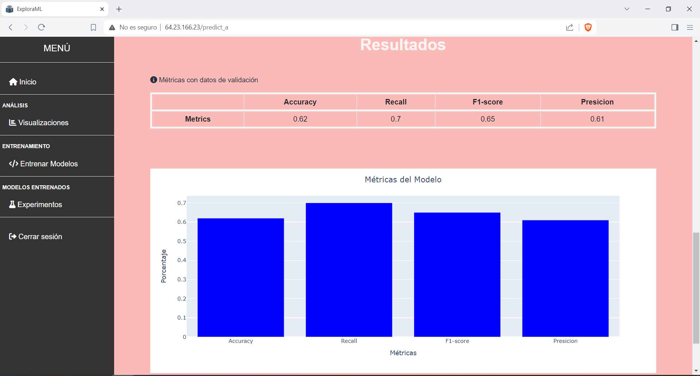

# ExploraML 🧙‍♀️ 

<div align='center'>

  [](https://www.gnu.org/licenses/gpl-3.0)

</div>
ExploraML is a web platform designed to introduce basic machine learning concepts, allowing users to interact with a churn prediction dataset and run different supervised learning techniques such as Logistic Regression, Stochastic Gradient Descent, Random Forest, Decision tree and compare their performance. 

<h3>Login</h3>



<h3>Explore models</h3>



<h3>Features selection - linear models</h3>



<h3>Scores - linear models</h3>



<h3>Features selection - tree-based models</h3>



<h3>Scores - tree-based models</h3>



## Technologies used
- Python
- Flask
- SQLite
- Plotly
- Pandas

## Installation and Usage
To install and run the application in your local environment, follow these steps:

Clone the repository:
```
git clone https://github.com/qagustina/explora_ml
```
Install the necessary dependencies using pip and the `requirements.txt` file:
```
pip install -r requirements.txt
```
Create a `config.py` file in the root directory of the project and define your own password:
```
# config.py

SECRET_KEY = 'your_key'
```
Initialize the database. Run the initialization script using the following command:
```
python __init__db.py
```
Run the app
```
python app.py
```
## License

Licensed under the [GNU General Public License, Version 3.0](https://www.gnu.org/licenses/gpl-3.0.txt)
